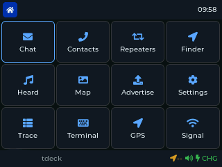
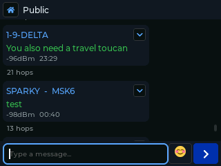
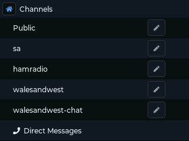
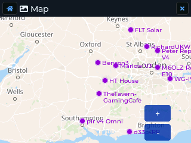
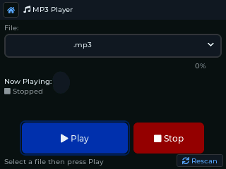

# Saitama

[](LICENSE)
[](https://github.com/868meshbot/Saitama/releases/latest)
[](https://github.com/868meshbot/Saitama/releases)
[](https://github.com/868meshbot/Saitama/actions)
[](https://www.lilygo.cc/products/t-deck)
[](https://github.com/meshcore-dev/MeshCore)

Open-source standalone firmware for LoRa mesh devices. Built on [MeshCore](https://github.com/meshcore-dev/MeshCore), designed for the LilyGo T-Deck and T-Deck Plus.

**A phone in your pocket, without the phone, and without the paywall.**

---

| Home | Chat | Channels |
|:----:|:----:|:--------:|
|  |  |  |

| Map | MP3 Player |
|:---:|:----------:|
|  |  |

---

## What Is This?

Saitama is a free, open-source firmware that turns affordable LoRa devices into powerful standalone mesh communicators. It provides smartphone-grade messaging, GPS maps, encrypted comms, and more, all running directly on the device with no phone, no internet, and no license fees required.

Saitama is a community project. Development tooling includes AI coding assistants — contributions are reviewed and tested by humans on real hardware.

## Features (Target)

- **Chat**: Public channels, private channels, direct messages with speech-bubble UI
- **GPS Map**: Offline tile-based map from SD card, node positions, route tracing
- **Encrypted Comms**: End-to-end encryption via MeshCore protocol
- **Repeater Scanner**: Discover and manage repeaters, signal strength, noise floor
- **Notifications**: Customizable alerts with screen wake, auto-dimming, lock screen
- **Terminal Access**: Full MeshCore terminal for power users
- **BLE Companion**: Connect with MeshCore mobile apps via Bluetooth
- **Config Import/Export**: Compatible with MeshCore companion app format

## Supported Hardware

| Device | Status | Notes |
|--------|--------|-------|
| LilyGo T-Deck (ESP32-S3) | Untested | 320x240 IPS, keyboard, trackball, SX1262 LoRa |
| LilyGo T-Deck Plus | **Working** | Primary target — compiled and hardware-tested |
| Other ESP32-S3 devices | Future | PlatformIO abstraction allows porting |

## Branches

| Branch | Purpose |
|--------|----------|
| `main` | Stable releases. Tagged with versions. Don't push directly. |
| `dev` | Active development. PRs go here. CI must pass before merge. |
| `alpha` | Created from `dev` when enough features accumulate for an alpha release. |
| `beta` | Created from `alpha` when features are hardware-tested and mostly working. |

Workflow: contribute to `dev` via PR. When enough changes accumulate, create `alpha` or `beta` branch from `dev`. When stable, merge to `main` and tag a release.

## Quick Start

### Prerequisites

- [PlatformIO](https://platformio.org/) installed (CLI or VS Code extension)
- USB-C cable
- A LilyGo T-Deck or T-Deck Plus

### Build

```bash
git clone --recurse-submodules https://github.com/868-Meshbot/Saitama.git
cd Saitama
pio run -e t-deck
```

### Flash

Hold the trackball center button, press the reset button on the side, then release both. The T-Deck is now in DFU mode.

**First time / recovery (merged binary):**
```bash
pio run -e t-deck -t upload
# Or manually with the merged binary:
esptool.py --chip esp32s3 --port /dev/ttyUSB0 write_flash 0x0 saitama-merged.bin
```

See [docs/VERSIONING.md](docs/VERSIONING.md) for firmware variant details.

### Map Tiles

Map tiles go on a FAT32-formatted SD card:

```
/maps/osm/{zoom}/{z}/{y}/{x}.png
```

Example: `/maps/osm/10/529/340.png`

**Option 1 — included CLI script:**

```bash
python3 scripts/download_tiles.py \
    --output /Volumes/SD/maps/osm \
    --lat 51.5 --lng -0.1 --radius 20 --zoom 10-14
```

See `scripts/download_tiles.py --help` for full options. Respect the [OSM tile usage policy](https://operations.osmfoundation.org/policies/tiles/) — rate-limited to 2 req/s.

**Option 2 — GUI tool ([map-tiles-downloader](https://github.com/tekk/map-tiles-downloader)):**

A graphical downloader with a map preview. Draw a bounding box, pick zoom levels, and it exports tiles in the correct `{z}/{y}/{x}.png` layout.

```
Output path: /Volumes/SD/maps/osm
```

## Project Structure

```
Saitama/
├── src/
│   ├── main.cpp              # Entry point
│   ├── hardware/
│   │   ├── Board.h/cpp       # T-Deck hardware abstraction
│   │   └── Keyboard.h/cpp   # BBQ10KB I2C keyboard driver
│   ├── mesh/
│   │   └── MeshService.h/cpp # MeshCore bridge
│   ├── ui/
│   │   ├── UIScreen.h/cpp    # LVGL display controller
│   │   ├── ScreenHome.h/cpp  # Chat screen
│   │   ├── ScreenMap.h/cpp   # Map screen
│   │   ├── ScreenSettings.h/cpp
│   │   ├── ScreenTerminal.h/cpp
│   │   └── Theme.h/cpp       # Colour palette
│   ├── map/
│   │   └── MapEngine.h/cpp   # Tile renderer
│   └── utils/
│       ├── Config.h/cpp      # Persistent settings
│       └── ConfigExport.h/cpp # SD card import/export (MeshCore format)
│       └── Log.h              # Serial logger
├── lib/
│   └── MeshCore/             # Git submodule (mesh protocol)
├── docs/
│   ├── UI_DESIGN.md          # ASCII art UI layouts
│   ├── ARCHITECTURE.md       # System design
│   ├── MAP_SYSTEM.md         # Map tile system design
│   ├── ROADMAP.md            # Development plan
│   ├── CONTRIBUTING.md       # How to help
│   └── HARDWARE.md           # T-Deck pin reference
├── platformio.ini
├── partitions.csv
└── LICENSE                   # GPL-3.0
```

## Architecture

Saitama is layered:

```
┌─────────────────────────────────┐
│         UI (LVGL 8.3)           │
│  Home │ Map │ Settings │ Term   │
├─────────────────────────────────┤
│        App Logic                 │
│  Messages │ Contacts │ Config    │
├─────────────────────────────────┤
│      Hardware Abstraction        │
│  Board │ Keyboard │ GPS │ LoRa   │
├─────────────────────────────────┤
│     MeshCore (C++ library)       │
│  Routing │ Encryption │ Radio    │
├─────────────────────────────────┤
│         ESP32-S3 Hardware         │
└─────────────────────────────────┘
```

- **MeshCore** handles all mesh networking: routing, encryption, packet handling
- **Board** abstracts T-Deck peripherals: display, keyboard, trackball, GPS, LoRa radio
- **App Logic** manages messages, contacts, settings, map state
- **UI** renders everything through LVGL with a consistent dark theme

No dynamic memory allocation after setup. No heap fragmentation. This is embedded software.

## Versioning

Saitama follows [Semantic Versioning](https://semver.org/) with pre-release tags:

- **`-alpha.N`** — compiles, not tested on hardware. Anything may break.
- **`-beta.N`** — running on hardware. Core features work but bugs expected.
- **`-rc.N`** — release candidate. Final testing.
- **(none)** — stable release.

Current version: **0.1.0-beta.1** (compiled and tested on LilyGo T-Deck Plus)

Each release includes two firmware binaries:
1. **App-only** (`saitama-X.Y.Z.bin`) — for OTA updates, flash at `0x10000`
2. **Merged** (`saitama-X.Y.Z-merged.bin`) — bootloader + partitions + app, flash at `0x0`

See [docs/VERSIONING.md](docs/VERSIONING.md) for full details.

## Status

Compiled and hardware-tested on a LilyGo T-Deck Plus. Core features (chat, mesh, GPS, repeater management, BLE companion) are functional. Edge cases and untested hardware variants are expected — contributions welcome.

## License

This project is licensed under the GNU General Public License v3.0 or later. See [LICENSE](LICENSE) for full text. Dependency licenses: MeshCore (MIT), LVGL (MIT), TFT_eSPI (MIT), ArduinoJson (MIT).

## Links

- [MeshCore](https://github.com/meshcore-dev/MeshCore) — the mesh networking library we depend on
- [LilyGo T-Deck](https://github.com/Xinyuan-LilyGO/T-Deck) — hardware reference
- [LVGL](https://lvgl.io/) — UI framework
- [TFT_eSPI](https://github.com/Bodmer/TFT_eSPI) — display driver
