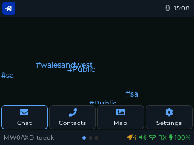
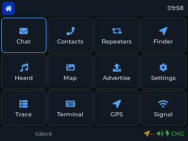
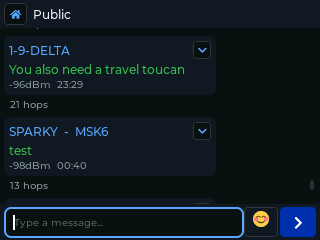
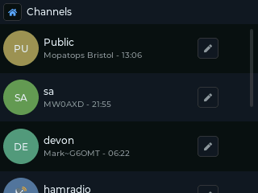
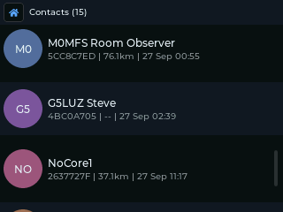
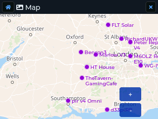
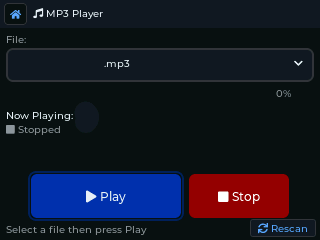

# Saitama

[](LICENSE)
[](https://github.com/868meshbot/Saitama/releases/latest)
[](https://github.com/868meshbot/Saitama/releases)
[](https://github.com/868meshbot/Saitama/actions)
[](https://www.lilygo.cc/products/t-deck)
[](https://github.com/meshcore-dev/MeshCore)

Your T-Deck, fully off-grid. Saitama is a standalone [MeshCore](https://github.com/meshcore-dev/MeshCore) messenger for the LilyGo T-Deck and T-Deck Plus: encrypted channels and DMs, a live view of every station around you, offline maps, and repeater and region tools, all on the device. No phone, no internet, no subscription. Free and open source.

**A phone in your pocket, without the phone, and without the paywall.**

---

| Home | Apps | Chat | Channels |
|:----:|:----:|:----:|:--------:|
|  |  | |  | 

| Contacts | Map | MP3 Player |
|:---:|:----:|:----------:|
| |  |  |

---

## What Is This?

Saitama is a free, open-source firmware that turns affordable LoRa devices into powerful standalone mesh communicators. It provides smartphone-grade messaging, GPS maps, encrypted comms, and more, all running directly on the device with no phone, no internet, and no license fees required.

Saitama is a community project. Development tooling includes AI coding assistants — contributions are reviewed and tested by humans on real hardware.

## Features

- **Home screen**: the stations heard this session fall like rain behind Chat / Contacts / Map / Settings — coloured by signal strength, channels in blue, with lines linking each new message to its channel, reply target or DM recipient. Swipe (or trackball past the edge) for the full app grids.
- **Chat**: Public plus up to 9 private channels, and direct messages, in a speech-bubble UI; unread counts and last-message previews; replies (`@[Name]`); DM auto-retries with delivery ticks; history saved to SD.
- **Region scopes**: a default flood scope plus up to 9 saved regions (Settings > Region Scope), a per-channel scope, and a **Regions** app that asks nearby repeaters which regions they serve — for meshes whose repeaters only forward scoped traffic.
- **Contacts, Repeaters & Heard**: contact and repeater directories with saved routes, repeater admin login (optional remembered password), path set/reset, and a live list of every station heard.
- **Network tools**: Finder (zero-hop neighbour scan), hop-by-hop Trace, Signal (RSSI/SNR/noise, airtime), channel scan, spectrum, PCAP capture, signal generator, BT foxhunt.
- **GPS Map**: offline tile map from the SD card with node positions.
- **Media & extras**: MP3 player, picture viewer, file manager, terminal, 2048.
- **Power**: CPU governor, screensaver and screen-off with radio light sleep, LoRa duty cycle or FHSS, RX boost, power estimates.
- **BLE Companion**: works with the MeshCore mobile apps over Bluetooth, paired with a per-device PIN.
- **Backup**: settings, contacts, repeaters and the node identity are mirrored to `/ops/` on the SD card and restored after a reflash.

## Security

- Mesh traffic is end-to-end encrypted by MeshCore.
- Secrets written to the SD card — channel keys, remembered repeater passwords and the node identity backup — are sealed with AES-256-GCM using a **storage password** (Settings > Storage Password). It starts as `changeme1`; **change it**, or a lifted SD card is as readable as that published default. See [docs/STORED_SECRETS.md](docs/STORED_SECRETS.md).
- The Bluetooth pairing PIN is random per device (Settings > Bluetooth PIN). Changing it unpairs all phones.
- Report vulnerabilities privately — see [docs/SECURITY.md](docs/SECURITY.md).

## Supported Hardware

| Device | Status | Notes |
|--------|--------|-------|
| LilyGo T-Deck (ESP32-S3) | Untested | 320x240 IPS, keyboard, trackball, SX1262 LoRa |
| LilyGo T-Deck Plus | **Working** | Primary target — compiled and hardware-tested |
| Other ESP32-S3 devices | Future | PlatformIO abstraction allows porting |

## Branches

| Branch | Purpose |
|--------|----------|
| `main` | Stable releases. Tagged with versions. Don't push directly. |
| `dev` | Active development. PRs go here. CI must pass before merge. |
| `lvgl9` | Experimental — LVGL 9.5.0 port. Not for production use. |

Workflow: contribute to `dev` via PR. When stable, merge to `main` and tag a release.

## Quick Start

### Prerequisites

- [PlatformIO](https://platformio.org/) installed (CLI or VS Code extension)
- USB-C cable
- A LilyGo T-Deck or T-Deck Plus

### Build

```bash
git clone --recurse-submodules https://github.com/868meshbot/Saitama.git
cd Saitama
pio run -e t-deck
```

### Flash

Hold the trackball center button, press the reset button on the side, then release both. The T-Deck is now in DFU mode.

**First time / recovery (merged binary):**
```bash
pio run -e t-deck -t upload
# Or manually with the merged binary:
esptool.py --chip esp32s3 --port /dev/ttyUSB0 write_flash 0x0 saitama-merged.bin
```

See [docs/VERSIONING.md](docs/VERSIONING.md) for firmware variant details.

### Map Tiles

Map tiles go on a FAT32-formatted SD card:

```
/maps/osm/{zoom}/{z}/{y}/{x}.png
```

Example: `/maps/osm/10/529/340.png`

**Option 1 — included CLI script:**

```bash
python3 scripts/download_tiles.py \
    --output /Volumes/SD/maps/osm \
    --lat 51.5 --lng -0.1 --radius 20 --zoom 10-14
```

See `scripts/download_tiles.py --help` for full options. Respect the [OSM tile usage policy](https://operations.osmfoundation.org/policies/tiles/) — rate-limited to 2 req/s.

**Option 2 — GUI tool ([map-tiles-downloader](https://github.com/tekk/map-tiles-downloader)):**

A graphical downloader with a map preview. Draw a bounding box, pick zoom levels, and it exports tiles in the correct `{z}/{y}/{x}.png` layout.

```
Output path: /Volumes/SD/maps/osm
```

## Project Structure

```
Saitama/
├── src/
│   ├── main.cpp              # Entry point: setup() + loop()
│   ├── version.h             # Release version
│   ├── hardware/
│   │   └── Board.h/cpp       # T-Deck hardware abstraction (display, keyboard, trackball, GPS, LoRa)
│   ├── mesh/
│   │   ├── MeshService.h/cpp # MeshCore bridge: messages, contacts, routes, scopes, BLE companion
│   │   └── Fhss.h/cpp        # Frequency hopping
│   ├── map/
│   │   └── MapEngine.h/cpp   # Tile renderer
│   ├── bt/
│   │   └── BTCompanionService.h/cpp  # BLE companion transport
│   ├── ui/
│   │   ├── UIScreen.h/cpp    # LVGL init, input drivers, tick loop, screensaver
│   │   ├── ScreenLauncher    # Home page (heard rain) + app grids
│   │   ├── ScreenHome        # Chat (channel list, conversations, DMs)
│   │   ├── ScreenSettings    # Settings
│   │   ├── ScreenRegions     # Region discovery
│   │   ├── ScopePicker       # Shared region-scope dropdown
│   │   ├── Screen*           # Contacts, Repeaters, Heard, Finder, Trace, Map, Terminal, tools…
│   │   └── Theme.h/cpp       # Colour palette and fonts
│   └── utils/
│       ├── Config.h/cpp      # Persistent settings (NVS + /ops/settings.json)
│       ├── Contacts / Repeaters / Regions  # Saved lists
│       ├── Crypto.h/cpp      # AES-256-GCM sealing for SD secrets
│       ├── IdentityBackup    # Encrypted node identity backup
│       ├── BtPin.h/cpp       # Bluetooth pairing PIN
│       ├── SDCard.h/cpp      # SD mount, /ops/ files, message logs
│       └── Log.h             # Serial logger
├── lib/
│   └── MeshCore/             # Git submodule (mesh protocol)
├── docs/                     # ARCHITECTURE, HARDWARE, STORED_SECRETS, SECURITY, FHSS, VERSIONING, …
├── scripts/                  # download_tiles.py and helpers
├── platformio.ini
├── partitions.csv
└── LICENSE                   # GPL-3.0
```

## Architecture

Saitama is layered:

```
┌─────────────────────────────────┐
│          UI (LVGL 8.3)          │
│ Home │ Chat │ Map │ Settings │ …│
├─────────────────────────────────┤
│            App Logic            │
│   Messages │ Contacts │ Config  │
├─────────────────────────────────┤
│       Hardware Abstraction      │
│  Board │ Keyboard │ GPS │ LoRa  │
├─────────────────────────────────┤
│      MeshCore (C++ library)     │
│   Routing │ Encryption │ Radio  │
├─────────────────────────────────┤
│        ESP32-S3 Hardware        │
└─────────────────────────────────┘
```

- **MeshCore** handles all mesh networking: routing, encryption, packet handling
- **Board** abstracts T-Deck peripherals: display, keyboard, trackball, GPS, LoRa radio
- **App Logic** manages messages, contacts, settings, map state
- **UI** renders everything through LVGL with a consistent dark theme

No dynamic memory allocation after setup. No heap fragmentation. This is embedded software.

## Versioning

Saitama follows [Semantic Versioning](https://semver.org/) with pre-release tags:

- **`-rc.N`** — release candidate. Final testing.
- **(none)** — stable release.

Current version: **1.4.1** (compiled and tested on LilyGo T-Deck Plus)

Each release includes two firmware binaries:
1. **App-only** (`saitama-X.Y.Z.bin`) — for OTA updates, flash at `0x10000`
2. **Merged** (`saitama-X.Y.Z-merged.bin`) — bootloader + partitions + app, flash at `0x0`

See [docs/VERSIONING.md](docs/VERSIONING.md) for full details.

## Status

Compiled and hardware-tested on a LilyGo T-Deck Plus. Core features (chat, mesh, region scopes, GPS, repeater management, BLE companion) are functional. Edge cases and untested hardware variants are expected — contributions welcome.

## License

This project is licensed under the GNU General Public License v3.0 or later. See [LICENSE](LICENSE) for full text. Dependency licenses: MeshCore (MIT), LVGL (MIT), TFT_eSPI (MIT), ArduinoJson (MIT).

## Links

- [MeshCore](https://github.com/meshcore-dev/MeshCore) — the mesh networking library we depend on
- [LilyGo T-Deck](https://github.com/Xinyuan-LilyGO/T-Deck) — hardware reference
- [LVGL](https://lvgl.io/) — UI framework
- [TFT_eSPI](https://github.com/Bodmer/TFT_eSPI) — display driver
